## Redis

## 补充

### Redis [管道、事务、Lua 脚本对比](https://blog.csdn.net/qq_35787138/article/details/113741467)

### 一.redis的持久化方式-**RDB和AOF**两种持久化机制

> Redis是基于内存的非关系型K-V数据库，既然它是基于内存的，如果Redis服务器挂了，数据就会丢失。为了避免数据丢失了，Redis提供了**持久化**，即把数据保存到磁盘。

持久化文件加载流程如下:


#### 1.RDB---Redis默认的持久化方式


在指定的时间间隔内将内存中的数据集快照写入磁盘

RDB 又分为两种：

- 一种是同步的，调用 save 命令即可触发 redis 进行 RDB 文件生成备份，但是这是一个同步命令，在备份完成之前，redis 服务器不响应客户端任何请求。
- 另一种是异步的，调用 bgsave 命令，redis 服务器 fork 一个子进程进行 RDB 文件备份生成，与此同时，主进程依然可以响应客户端请求。

两种触发方式：手动触发（save命令），自动触发（bgsave命令，推荐）
 save命令：阻塞当前redis直到rdb持久化完成。若内存实例较大，会造成长时间阻塞，线上环境不建议使用。
 bgsave命令：redis进程执行fork命令创建子进程来完成持久化，阻塞时间短（微秒级），save命令的优化。
 bgsave触发的条件：
 1.在redis-cli中执行shutdown关闭redis服务时，如果没有开启aof持久化，自动执行bgsave命令
 2.redis.conf中save m n 若redis在m秒内有n次命令执行则触发
 3.从节点刚上线时，触发主节点bgsave命令，然后将生成的rdb文件发送给从节点完成全量复制

fork是linux系统的调用：在当前进程中，fork一个子进程，子进程最初与主进程是共享一份内存区域的。由于主进程不断进行数据的写操作，与子进程存在并发冲突问题。此时，redis采用**写时复制技术**（cow）：
 当主进程写操作时，首先会复制一份将要涉及写操作的内存页。然后主进程在新复制的内存页上进行写操作，原有内存页继续供子进程持久化

##### 相关配置

1.save   触发bgsave

```bash
save 900 1           # 900秒内执行一次set操作 则持久化1次  
save 300 10         # 300秒内执行10次set操作,则持久化1次
save 60 10000     # 60秒内执行10000次set操作,则持久化1次
```

2.在redis.conf文件中有设置 默认是文件名和保存路径（默认是 当前启动目录下  就是执行启动命令的目录）


3. stop -writes -on-bgsave-er ror当Redis无法写入磁盘的话(磁盘满了)，直接关掉Redis的写操作。推荐yes.


4.rdbcompression

对于存储到磁盘中的快照，可以设置是否进行压缩存储。如果是的话，redis会采用LZF算法进行压缩。

如果你不想消耗CPU来进行压缩的话，可以设置为关闭此功能。推荐yes.

5.rdbchecksum检查完整性

在存储快照后，还可以让redis使用CRC64算法来进行数据校验，校验 RDB 文件是否发生损坏

但是这样做会增加大约10%的性能消耗，如果希望获取到最大的性能提升，可以关闭此功能推荐yes.

##### 优缺点

+ 优点：

l 灵活设置备份频率和周期。

l 适合大规模的数据恢复，非常适合冷备份，对于灾难恢复而言，RDB 是非常不错的选择。保存在其他云存储上

l 对数据完整性和一致性要求不高更适合使用

l 节省磁盘空间

l 性能最大化，可以让 Redis 保持高性能。

l 恢复速度快，相比于 AOF 机制，RDB 的恢复速度更更快，更适合恢复数据，特别是在数据集非常大的情况。

+ 缺点：

l Fork的时候，内存中的数据被克隆了一份，大致2倍的膨胀性需要考虑

l 在备份周期在一定间隔时间做一次备份，所以如果Redis意外down掉的话，就会丢失最后一次快照后的所有修改

l 如果数据集很⼤，fork() 可能很耗时，并且如果数据集很⼤且CPU 性能不佳，则可能导致 Redis 停⽌为客⼾端服务⼏毫秒甚⾄⼀秒钟。

> ​    所以，RDB 建议在业务低时执行，例如在半夜执行。

#### 2.AOF（Append Only File)

以日志的形式来记录每个写操作（增量保存），将Redis执行过的所有写指令记录下来(读操作不记录)， 只许追加文件但不可以改写文件。


默认不开启，改为yes 打开。保存的路径与rdb一样。


AOF和RDB同时开启，系统默认取AOF的数据（数据不会存在丢失）

数据备份恢复和rdb一样: 保存一份文件，当发生错误后，copy过来, 重启redis

#### 异常恢复

修改默认的appendonly no，改为yes

如遇到AOF文件损坏，通过/usr/local/bin/redis-check-aof--fix appendonly.aof进行恢复

备份被写坏的AOF文件

恢复：重启redis，然后重新加载

##### 相关配置

***AOF同步频率设置***

appendfsync always

始终同步，每次Redis的写入都会立刻记入日志；性能较差但数据完整性比较好

appendfsync everysec

每秒同步，每秒记入日志一次，如果宕机，本秒的数据可能丢失。

appendfsync no

redis不主动进行同步，把同步时机交给操作系统。

***Rewrite压缩***

重写压缩机制，AOF文件的大小超过所设定的阈值时，Redis就会启动AOF文件的内容压缩， 只保留可以恢复数据的最小指令集

Redis会记录上次重写时的AOF大小，默认配置是当AOF文件大小是上次rewrite后大小的一倍且文件大于64M时触发

如果Redis的AOF当前大小>= base_size +base_size*100% (默认)且当前大小>=64mb(默认)的情况下，Redis会对AOF进行重写。

##### AOF持久化流程

（1）客户端的请求写命令会被append追加到AOF缓冲区内；

（2）AOF缓冲区根据AOF持久化策略[always,everysec,no]将操作sync同步到磁盘的AOF文件中；（默认是everysec）

（3）AOF文件大小超过重写策略或手动重写时，会对AOF文件rewrite重写，压缩AOF文件容量；

（4）Redis服务重启时，会重新load加载AOF文件中的写操作达到数据恢复的目的；

##### 优缺点

优

+ 备份机制更稳健，丢失数据概率更低。

+ 可读的日志文本，通过操作AOF稳健，可以处理误操作。

缺

+ 比起RDB占用更多的磁盘空间。

+ 恢复备份速度要慢。

+ 每次读写都同步的话，有一定的性能压力。

+ 存在个别Bug，造成恢复不能。


> 官方推荐两个都启用。
>
> 如果对数据不敏感，可以选单独用RDB。
>
> 不建议单独用 AOF，因为可能会出现Bug。
>
> 如果只是做纯内存缓存，可以都不用。

同时开启时

#### 3.RDB-AOF混合持久化

```
# When rewriting the AOF file, Redis is able to use an RDB preamble in the
# AOF file for faster rewrites and recoveries. When this option is turned
# on the rewritten AOF file is composed of two different stanzas:
#
#   [RDB file][AOF tail]
#
# When loading Redis recognizes that the AOF file starts with the "REDIS"
# string and loads the prefixed RDB file, and continues loading the AOF
# tail.
aof-use-rdb-preamble yes
```

开启后

Redis服务器 在执行 AOF重写操作时，就会像执行BGSAVE命令那样，根据数据库当前的状态 生成出 相应的RDB数据，并将这些数据 写入 新建的AOF文件中，至于那些 在AOF重写开始之后 执行的Redis命令，则会继续以协议文本的方式 追加到 新AOF文件的末尾，即已有的RDB数据的后面

+ 在该模式下，AOF 重写产生的文件将同时包含 RDB 格式的内容和 AOF 格式的内容，**该文件的前半段是 RDB 格式的全量数据，而后半段是 Redis 命令格式的增量数据**

> 当一个支持RDB-AOF混合持久化模式的Redis服务器启动并载入AOF文件时，它会检查AOF文件的开头是否包含了RDB格式的内容
>
> 

### 二.Redis 主从复制

主机数据更新后根据配置和策略， 自动同步到备机的master/slaver机制，***Master以写为主，Slave以读为主***

一主多从 写服务器只有一个


作用：

+ 读写分离

+ 容灾的快速恢复

  一个从服务器G了，应该继续使用另一个从服务器

> 如果担心主G了 可以使用集群
>
> 

实践：

info replication 查看当前的状态

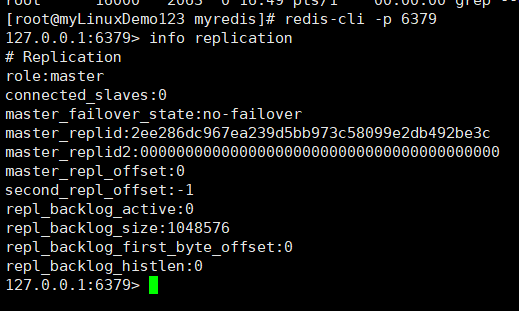

在从机上执行  ``` slaveof <ip> <port>  ```  成为某个实例的从服务器

slaveof 127.0.0.1 6379

如果 master 和 slave 都设置了密码，并且密码相同（必须），则验证成功。

最终效果：

+ 在主机上写，在从机上可以读取数据 ，在从机上写数据报错
+ 主机挂掉，重启就行，一切如初
+ 从机重启需重设：slaveof 127.0.0.1 6379（可以将配置增加到文件中。永久生效。）

问题1：一个从服务器 挂了一段时间，然后又重新活了。期间主已经写过数据了，==从服务器中重新启动后，也有挂期间写的数据，会自动复制过来==

#### 主从复制的原理

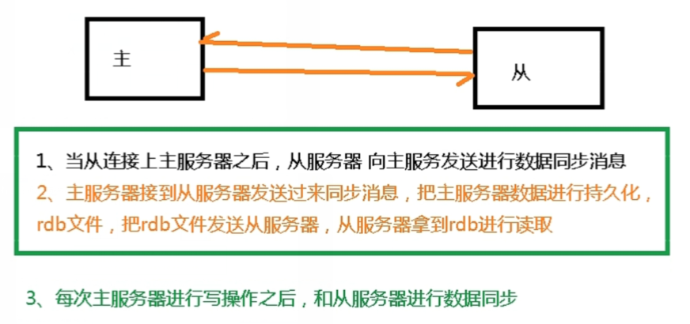

详细：

1.主从服务器间的第一次同步的过程可分为三个阶段：

- 第一阶段是建立链接、协商同步；
- 第二阶段是主服务器同步数据给从服务器；
- 第三阶段是主服务器发送新写操作命令给从服务器。

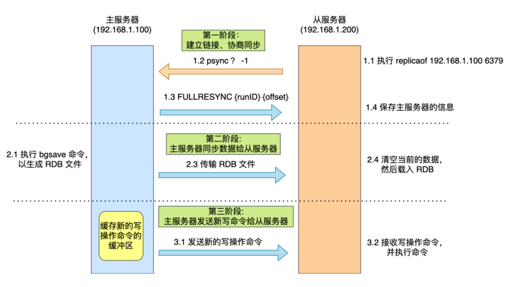

psync 命令包含两个参数，分别是主服务器的 runID 和复制进度 offset。

    runID，每个 Redis 服务器在启动时都会自动生产一个随机的 ID 来唯一标识自己。当从服务器和主服务器第一次同步时，因为不知道主服务器的 run ID，所以将其设置为 “?”。
    offset，表示复制的进度，第一次同步时，其值为 -1。
从服务器收到 RDB 文件后，会先清空当前的数据，然后载入 RDB 文件。

但是这期间的写操作命令并没有记录到刚刚生成的 RDB 文件中，这时主从服务器间的数据就不一致了。

那么为了保证主从服务器的数据一致性，主服务器会将在 RDB 文件生成后收到的写操作命令，写入到 replication buffer 缓冲区里。

第三阶段：主服务器发送新写操作命令给从服务器

在主服务器生成的 RDB 文件发送后，然后将 replication buffer 缓冲区里所记录的写操作命令发送给从服务器，然后从服务器重新执行这些操作。

至此，主从服务器的第一次同步的工作就完成了。

2.主从服务器在完成第一次同步后，双方之间就会维护一个 TCP 连接

**基于长连接的命令传播**，通过这种方式来保证第一次同步后的主从服务器的数据一致性。

问题：

主从服务器在完成第一次同步后，就会基于长连接进行命令传播。

可是，网络总是不按套路出牌的嘛，说延迟就延迟，说断开就断开。

如果主从服务器间的网络连接断开了，那么就无法进行命令传播了，这时从服务器的数据就没办法和主服务器保持一致了，客户端就可能从「从服务器」读到旧的数据。

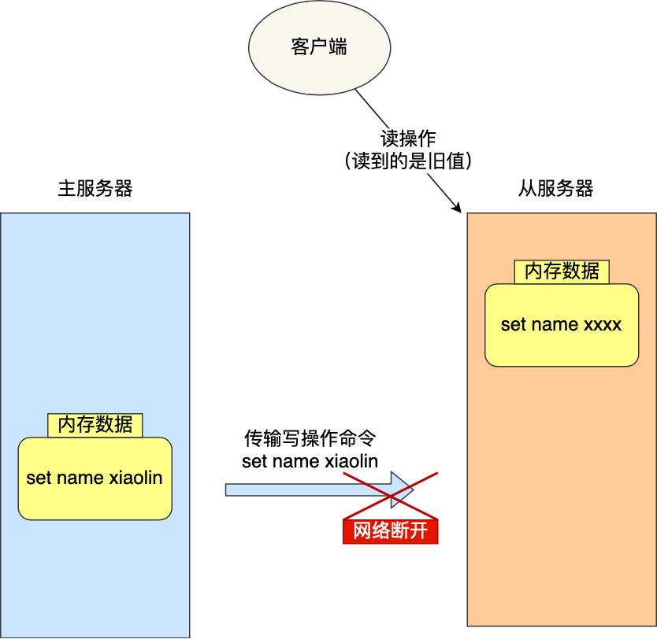

在 Redis 2.8 之前，如果主从服务器在命令同步时出现了网络断开又恢复的情况，从服务器就会和主服务器重新进行一次全量复制，很明显这样的开销太大了，必须要改进一波。

从 Redis 2.8 开始，网络断开又恢复后，从主从服务器会采用**增量复制**的方式继续同步，也就是只会把网络断开期间主服务器接收到的写操作命令，同步给从服务器。

主要有三个步骤：

    从服务器在恢复网络后，会发送 psync 命令给主服务器，此时的 psync 命令里的 offset 参数不是 -1；
    主服务器收到该命令后，然后用 CONTINUE 响应命令告诉从服务器接下来采用增量复制的方式同步数据；
    然后主服务将主从服务器断线期间，所执行的写命令发送给从服务器，然后从服务器执行这些命令。
主从复制共有三种模式：**全量复制、基于长连接的命令传播、增量复制**。

#### 薪火相传

可以知道主从服务器在第一次数据同步的过程中，主服务器会做两件耗时的操作：生成 RDB 文件和传输 RDB 文件。

我们在「从服务器」上执行 ```replicaof <目标服务器的IP> 6379```，使其作为目标服务器的从服务器。从服务器又挂了一个从服务器

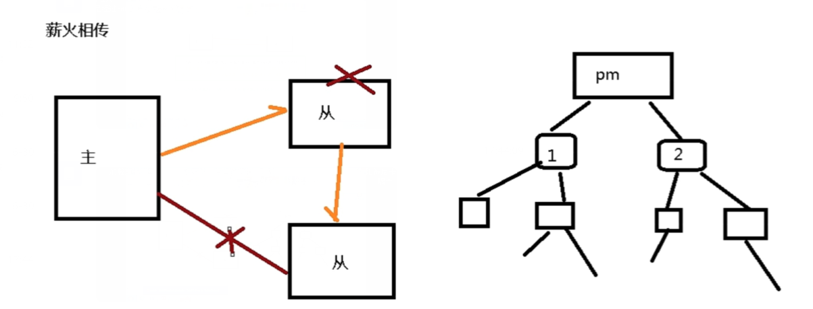

缺点就是从服务器挂了 另一个从也无法同步了（我的从的从 不是我的从 hhhhhh）

#### 哨兵模式-反客为主

手动：

当一个master宕机后，后面的slave可以立刻升为master，其后面的slave不用做任何修改。用 slaveof  no one  将从机变为主机。

哨兵模式：能够后台监控主机是否故障，如果故障了根据投票数自动将从库转换为主库

##### 配置

例：在一主二从的基础上 操作

目录下新建sentinel.conf文件，名字绝不能错。

内容：

sentinel monitor mymaster 127.0.0.1 6379 1

其中mymaster为监控对象起的服务器名称， 1 为至少有多少个哨兵同意迁移的数量。

 第三个参数：哨兵名字，可自行修改。（若修改了，那后面涉及到的都得同步） 
 第四个参数：master主机ip地址
 第五个参数：redis端口号
 第六个参数：哨兵的数量。比如2表示，当至少有2个哨兵发现master的redis挂了，那么就将此master标记为宕机节点。
这个时候就会进行故障的转移，将其中的一个从节点变为master


redis-sentinel /myredis/sentinel.conf  启动哨兵模式

主机挂掉后 哨兵的输出： 红线下

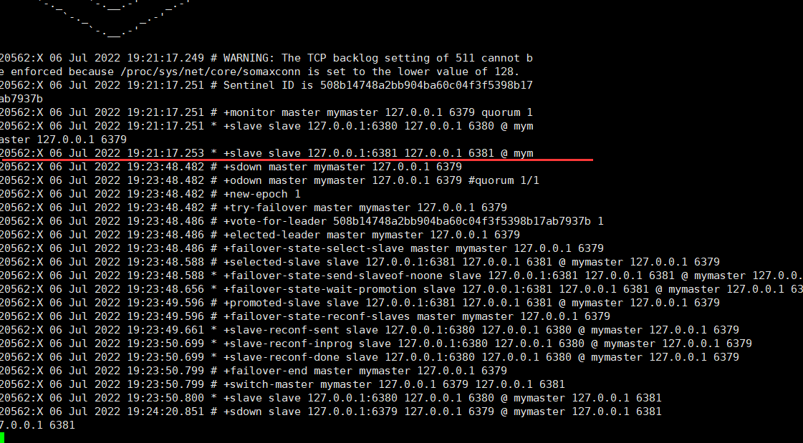

 +switch-master mymaster 127.0.0.1 6379 127.0.0.1 6381

选择了6381这台作为主机，原来的6379重新启动后成为了从机（如果3679没有配置密码 要配置一致的密码）

哪个从机会被选举为主机呢？


根据优先级别：slave-priority

偏移量是指获得原主机数据最全的

每个redis实例启动后都会随机生成一个40位的runid

优先级在redis.conf中默认：slave-priority 100，（有的版本是replica-priority）值越小优先级越高

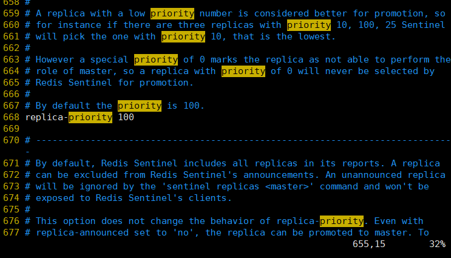

[参考](https://blog.csdn.net/qq_34827674/article/details/123448733)

[参考](https://www.bilibili.com/video/BV1Rv41177Af?p=33&spm_id_from=333.1007.top_right_bar_window_history.content.click)

### 三.Redis集群

#### 概念

容量不够，redis如何进行扩容？

1.一台变多台可以解决 集群

并发写操作， redis如何分摊？

1.集群

另外，主从模式，薪火相传模式，主机宕机，导致ip地址发生变化，应用程序中配置需要修改对应的主机地址、端口等信息。

之前通过代理主机来解决，但是redis3.0中提供了解决方案。就是无中心化集群配置。

**代理主机**：客户机和服务器之间通过一个代理机 由代理机先不同的Redis服务器发送请求 接收数据

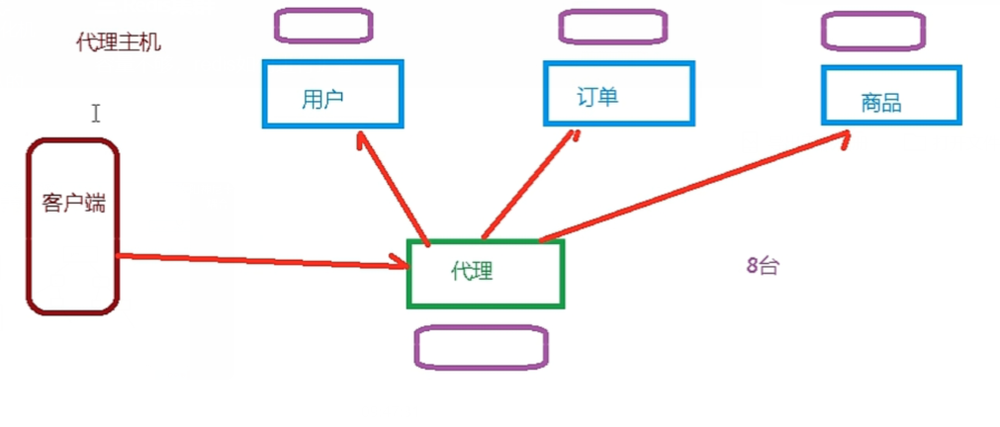

缺点： 服务器数量多 维护不方便

**无中心化**:

请求打到集群中，自动转移到目标服务器

3主3从

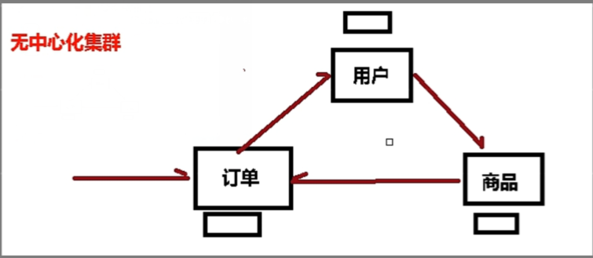

Redis 集群实现了对Redis的水平扩容，即启动N个redis节点，将整个数据库分布存储在这N个节点中，每个节点存储总数据的1/N。

Redis 集群通过分区（partition）来提供一定程度的可用性（availability）： 即使集群中有一部分节点失效或者无法进行通讯， 集群也可以继续处理命令请求。

#### 配置

开启daemonize yes

Pid文件名字

指定端口

Log文件名字

Dump.rdb名字

Appendonly 关掉或者换名字

配置文件中：

cluster-enabled yes  打开集群模式

cluster-config-file nodes-6379.conf 设定节点配置文件名

cluster-node-timeout 15000  设定节点失联时间，超过该时间（毫秒），集群自动进行主从切换。

以 6 个为例 6个端口 模拟6个服务器

3678端口的，其他端口和下面一样只要改一下数字

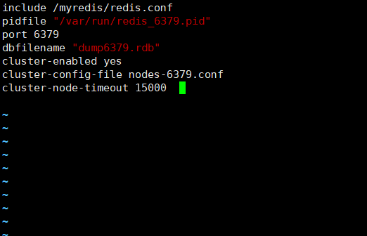

启动6个redis服务组合之前，请确保所有redis实例启动后，nodes-xxxx.conf文件都生成正常

新版本（6.2）中不需要装ruby环境

进入到开始安装redis的src下

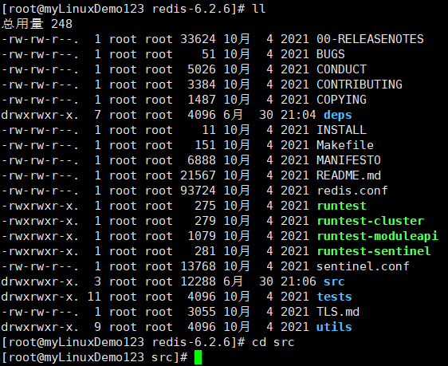

在该路径下执行

redis-cli --cluster create --cluster-replicas 1 192.168.200.130:6379 192.168.200.130:6380 192.168.200.130:6381 192.168.200.130:6389 192.168.200.130:6390 192.168.200.130:6391

6个节点合成一个集群

+ --cluste 表示集群操作
+ --cluster-replicas 集群的方式    1 就表示最简单的方式配置集群，一台主机，一台从机，目前正好三组。2 就是 一台主机，两个从机

**此处不要用127.0.0.1， 请用真实IP地址**

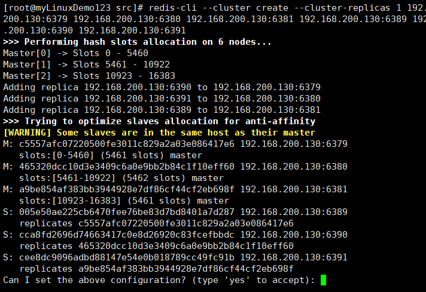

主从已经分配好了。是否接受

[OK] All 16384 slots covered.

``` redis-cli -c -p 6379 ```      -c 采用集群策略连接，设置数据会自动切换到相应的写主机

```cluster nodes```  查看集群信息

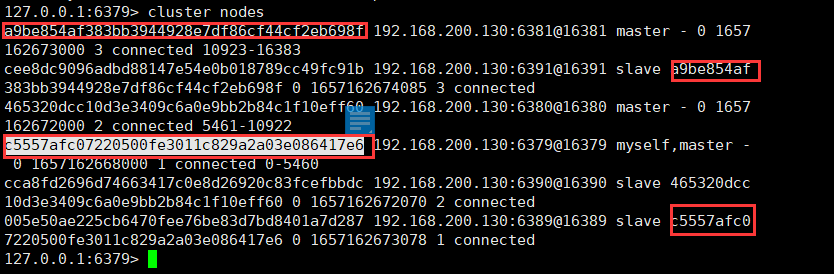

#### 什么是slots

集群搭建完成 有这个提示

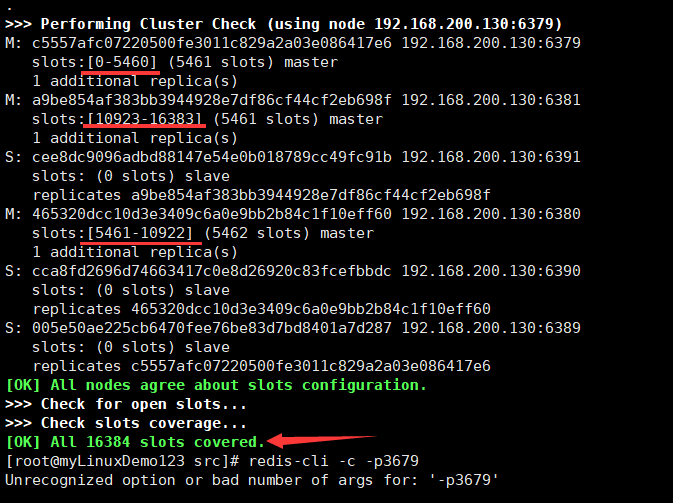

一个 Redis 集群包含 16384 个插槽（hash slot）， 数据库中的每个键都属于这 16384 个插槽的其中一个， 

集群使用公式 CRC16(key) % 16384 来计算键 key 属于哪个槽， 其中 CRC16(key) 语句用于计算键 key 的 CRC16 校验和 。

集群中的每个节点负责处理一部分插槽。 举个例子， 如果一个集群可以有主节点， 其中：

节点 A 负责处理 0 号至 5460 号插槽。

节点 B 负责处理 5461 号至 10922 号插槽。set

节点 C 负责处理 10923 号至 16383 号插槽。


> 不在一个slot下的键值，是不能使用mget,mset等多键操作。

多个值添加 需要用大括号。可以通过{}来定义组的概念，从而使key中{}内相同内容的键值对放到一个slot中去。

```
mset <key1><value1><key2><value2>

 mset name{user} aa age{user} 20 
```

```CLUSTER keyslot X``` 计算x的插槽值

```CLUSTER countkeysinslot <slot>```计算这个卡槽中的键的数量（只能当前库对应范围内的，如果是其他库，会返回0）

```CLUSTER GETKEYSINSLOT <slot><count>```返回 count 个 slot 槽中的键。

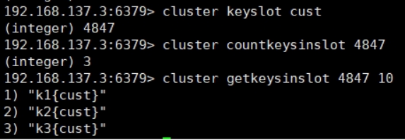

#### 故障恢复

+ 如果主节点下线G了  从节点自动升为主节点 注意：15秒超时

+ 主节点回来后会变成从机。

+ 如果某一段插槽的主从（6个挂了2个）都挂掉，而cluster-require-full-coverage 为yes ，那么 ，整个集群都挂掉

  如果某一段插槽的主从都挂掉，而cluster-require-full-coverage 为no ，那么，该插槽数据全都不能使用，也无法存储。

#### Jedis的相关操作

即使连接的不是主机，集群会自动切换主机存储。主机写，从机读。

无中心化主从集群。无论从哪台主机写的数据，其他主机上都能读到数据。

```java
public class JedisClusterTest {
  public static void main(String[] args) {
//     Set<HostAndPort> set =new HashSet<HostAndPort>();
//     //HostAndPort 随便一个都行 每一个都能作为集群的入口
//     set.add();
     JedisCluster jedisCluster=new JedisCluster(new HostAndPort("192.168.200.130",6379)); //传入set或一个HostAndPort 都可以
     jedisCluster.set("bbb1", "v111");
     System.out.println(jedisCluster.get("bbb1"));
  }
}
```

#### 优缺点

Redis集群提供了以下好处

+ 实现扩容

+ 分摊压力

+ 无中心配置相对简单

Redis集群的不足

+ 多键操作是不被支持的 

+ 多键的Redis事务是不被支持的。lua脚本不被支持

+ 由于集群方案出现较晚，很多公司已经采用了其他的集群方案，而代理或者客户端分片的方案想要迁移至redis cluster，需要整体迁移而不是逐步过渡，复杂度较大。

### 四.Redis 实际应用中的一些问题

#### 1.缓存穿透

##### 概念

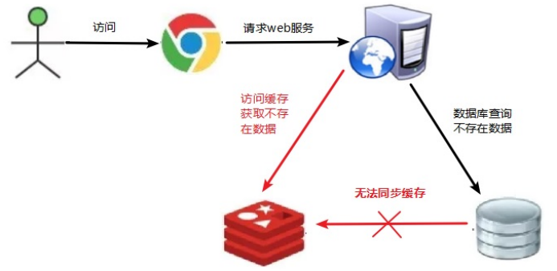

+ 应用服务器 压力突然变大

先查缓存，缓存中没有再查数据库， 放在缓存

+ 大量请求时 redis查不到数据了 redis缓存命中率减低了
+ 导致一直去查数据库，数据库压力太大，导致奔溃

产生原因：

+ 服务突然增加，redis查不到数据了 redis缓存命中率减低了

+ 出现很多非URL访问（就是请求参数里面的值 本来就是数据库中没有的）*(应该是遭到攻击了)

根本：缓存没起到作用

##### 解决方案

一个一定不存在缓存及查询不到的数据，由于缓存是不命中时被动写的，并且出于容错考虑，如果从存储层查不到数据则不写入缓存，这将导致这个不存在的数据每次请求都要到存储层去查询，失去了缓存的意义。

解决方案：

（1） **对空值缓存：**如果一个查询返回的数据为空（不管是数据是否不存在），我们仍然把这个空结果（null）进行缓存，设置空结果的过期时间会很短，最长不超过五分钟

（2） **设置可访问的名单（白名单）：**

使用bitmaps类型（位操作）定义一个可以访问的名单，名单里是对所有可能查询到的参数。名单id作为bitmaps的偏移量，每次访问和bitmap里面的id进行比较，如果访问id不在bitmaps里面，进行拦截，不允许访问。

（3） **采用布隆过滤器**：(布隆过滤器（Bloom Filter）是1970年由布隆提出的。它实际上是一个很长的二进制向量(位图)和一系列随机映射函数（哈希函数）。

布隆过滤器可以用于检索一个元素是否在一个集合中。它的优点是空间效率和查询时间都远远超过一般的算法，缺点是有一定的误识别率和删除困难。)

将所有可能存在的数据哈希到一个足够大的bitmaps中，一个一定不存在的数据会被 这个bitmaps拦截掉，从而避免了对底层存储系统的查询压力。

（4） **进行实时监控：**当发现Redis的命中率开始急速降低，需要排查访问对象和访问的数据，和运维人员配合，可以设置黑名单限制服务

#### 2.缓存击穿

##### 概念


现象 ：

+ 数据库访问压力突然增加
+ redis里面没有出现过期
+ redis平稳运行状态

原因

当某个 key 在过期的瞬间，有大量的请求这个 key 的数据，这种数据是热点数据。由于在缓存过期的瞬间，请求会同时访问到持久化的数据库来查询数据，并且会将数据会写到缓存中，此时就会导致数据库瞬间的压力过大，导致击穿

+ redis某个key过期了，这个key有目前有大量的访问 ( 热点key

##### 解决方案

> key可能会在某些时间点被超高并发地访问，是一种非常“热点”的数据。这个时候，需要考虑一个问题：缓存被“击穿”的问题。

解决问题：

**（1）预先设置热门数据：**在redis高峰访问之前，把一些热门数据提前存入到redis里面，加大这些热门数据key的时长

**（2）实时调整：**现场监控哪些数据热门，实时调整key的过期时长

**（3）使用锁：**可以解决 但是效率低

（1） 就是在缓存失效的时候（判断拿出来的值为空），不是立即去load db。

（2） 先使用缓存工具的某些带成功操作返回值的操作（比如Redis的SETNX）去set一个mutex key

（3） 当操作返回成功时，再进行load db的操作，并回设缓存,最后删除mutex key；

（4） 当操作返回失败，证明有线程在load db，当前线程睡眠一段时间再重试整个get缓存的方法。

 

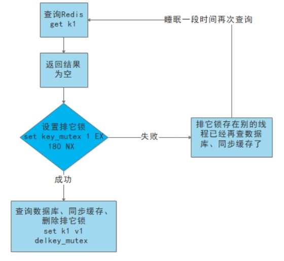

> 击穿和穿透的区别：
>
> 击穿，是一个 key 非常热点，大量的访问都打在这个 key 上面，在 key 失效的瞬间，所有请求打在数据库上，就打出一个洞，击穿了
>
> 而穿透是更多的是访问的数据不存在的情况，大量的请求访问的都是不存在的数据


#### 3.缓存雪崩

##### 概念

就是在某一个时间段，**缓存集中过期**，或者 **redis 宕机**的情况会出现

key对应的数据存在，但在redis中过期，此时若有大量并发请求过来，这些请求发现缓存过期一般都会从后端DB加载数据并回设到缓存，这个时候大并发的请求可能会瞬间把后端DB压垮。

缓存雪崩与缓存击穿的区别在于这里针对很多key缓存，前者则是某一个key

例如：

在某些热点活动中，会设置某些商品在一个固定的时间内过期，那么在 redis 里面，这个固定的时间点，大量的 key 过期，这就导致在这个时间段 缓存失效了，

且大量的请求数据都打在了持久化数据库上面了，这就很难受，在这种压力波峰下，压力全部打在持久化数据库上，这会造成持久化数据库宕机

造成

##### 解决方案

缓存失效时的雪崩效应对底层系统的冲击非常可怕！

解决方案：

（1） **构建多级缓存架构：**nginx缓存 + redis缓存 +其他缓存（ehcache等）

（2） **使用锁或队列**：

用加锁或者队列的方式保证来保证不会有大量的线程对数据库一次性进行读写，从而避免失效时大量的并发请求落到底层存储系统上。不适用高并发情况

（3） **设置过期标志更新缓存：**

记录缓存数据是否过期（设置提前量），如果即将过期会触发通知另外的线程在后台去更新实际key的缓存。

（4） **将缓存失效时间分散开：**

比如我们可以在原有的失效时间基础上增加一个随机值，比如1-5分钟随机，这样每一个缓存的过期时间的重复率就会降低，就很难引发集体失效的事件。

**将 redis 做成高可用的**
 搭建 redis 集群，异地多活，既然担心 redis 会挂，那么我们就多准备一些 redis ，做成主备，或者异地多活

#### 4.分布式锁

随着业务发展的需要，原单体单机部署的系统被演化成分布式集群系统后，由于分布式系统多线程、多进程并且分布在不同机器上，这将使原单机部署情况下的并发控制锁策略失效，单纯的Java API并不能提供分布式锁的能力。为了解决这个问题就需要一种**跨JVM的互斥机制来控制共享资源的访问**，这就是分布式锁要解决的问题！

这个锁要对整个集群都有效，而不是针对一个机器

分布式锁主流的实现方案：

1. 基于数据库实现分布式锁

2. 基于缓存（Redis等）

3. 基于Zookeeper

每一种分布式锁解决方案都有各自的优缺点：

1. 性能：redis最高

2. 可靠性：zookeeper最高

redis实现分布式锁：

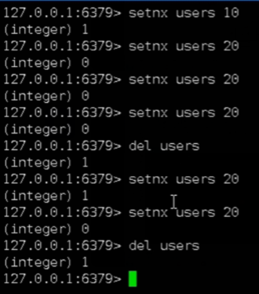

setnx  相当于加锁，   del  相当于释放 ，  在这个过程中 其他的不能setnx 同一个k

> 出现问题： 如果加锁的程序卡死  或 sleep   导致后面所有程序进不去
>
> 解决：给锁加过期时间  自动释放
>
> setnx user 10
>
> expire user   10  (10秒过期)

> 出现问题：两步操作  在第一步上锁后 突然断电，那就......无法设置过期时间
>
> 解决：set user 10 nx ex 12  (12秒过期)

> 问题：可能会释放其他服务器的锁。
>
> 场景1：如果业务逻辑的执行时间是7s。执行流程如下。**关键点**：7s后会del,但是3s时已经自动释放了，那我7s del的可能是其他人的锁
>
> 1. index1业务逻辑没执行完，3秒后锁被自动释放。
>
> 2. index2获取到锁，执行业务逻辑，3秒后锁被自动释放。
>
> 3. index3获取到锁，执行业务逻辑
>
> 4. index1业务逻辑执行完成，开始调用del释放锁，这时释放的是index3的锁，导致index3的业务只执行1s就被别人释放。
>
> 最终等于没锁的情况。
>
> 场景2：和场景1差不多
>
> 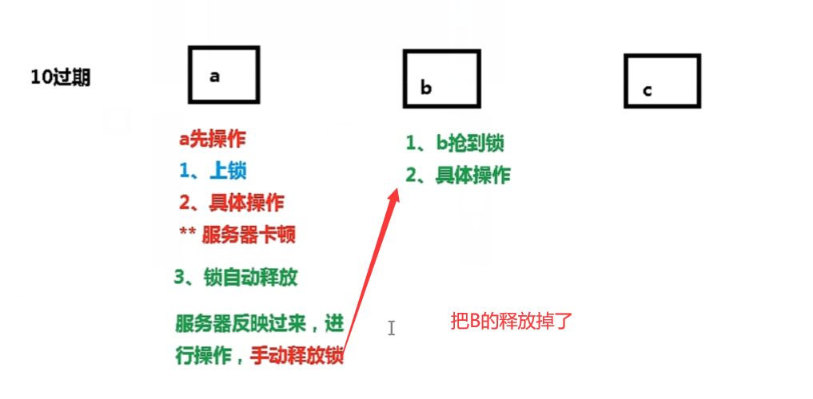
>
> 解决：setnx获取锁时，设置一个指定的唯一值（例如：uuid）；释放前获取这个值，判断是否自己的锁
>
> 锁的value值为一个随机生成的UUID，通过此在释放锁的时候进行判断
>
> 
>
> 
>
> **加锁的时候 设一个自己的UUID ,最后删的时候  如果是我加的那个锁 我才删 ，否则不用管**


> 问题：删除操作缺乏原子性。
>
> 精确到了行
>
> 解决：LUA脚本保证删除的原子性 （集群不支持lua???  所以我们解决分布式问题的redis 不能是集群。貌似也没必要是集群）   保证比较后就去删除，不让自动释放的命令去插队
>
> 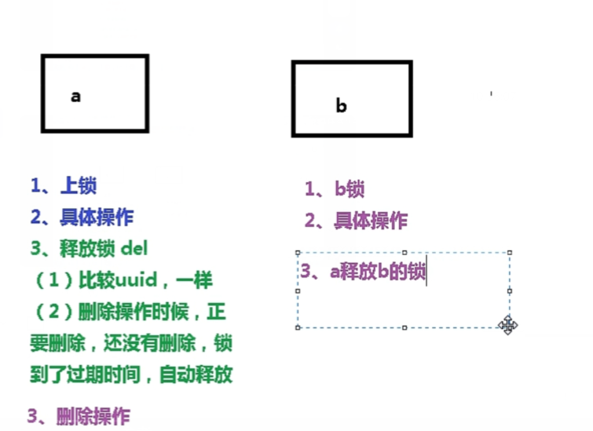

```java
@GetMapping("testLockLua")
public void testLockLua() {
    //1 声明一个uuid ,将做为一个value 放入我们的key所对应的值中
    String uuid = UUID.randomUUID().toString();
    //2 定义一个锁：lua 脚本可以使用同一把锁，来实现删除！
    String skuId = "25"; // 访问skuId 为25号的商品 100008348542
    String locKey = "lock:" + skuId; // 锁住的是每个商品的数据

    // 3 获取锁  加锁有原子性
    Boolean lock = redisTemplate.opsForValue().setIfAbsent(locKey, uuid, 3, TimeUnit.SECONDS);

    if (lock) {
        // 执行的业务逻辑开始
        // 获取缓存中的num 数据
        Object value = redisTemplate.opsForValue().get("num");
        // 如果是空直接返回
        if (StringUtils.isEmpty(value)) {
            return;
        }
        // 不是空 如果说在这出现了异常！ 那么delete 就删除失败！ 也就是说锁永远存在！
        int num = Integer.parseInt(value + "");
        // 使num 每次+1 放入缓存
        redisTemplate.opsForValue().set("num", String.valueOf(++num));
        /*使用lua脚本来释放锁*/
        // 定义lua 脚本
        String script = "if redis.call('get', KEYS[1]) == ARGV[1] then return redis.call('del', KEYS[1]) else return 0 end";
        // 使用redis执行lua执行
        DefaultRedisScript<Long> redisScript = new DefaultRedisScript<>();
        redisScript.setScriptText(script);
        // 设置一下返回值类型 为Long
        // 因为删除判断的时候，返回的0,给其封装为数据类型。如果不封装那么默认返回String 类型，
        // 那么返回字符串与0 会有发生错误。
        redisScript.setResultType(Long.class);
        // 第一个要是script 脚本 ，第二个需要判断的key，第三个就是key所对应的值。
        redisTemplate.execute(redisScript, Arrays.asList(locKey), uuid);
    } else {
        // 其他线程等待
        try {
            // 睡眠
            Thread.sleep(1000);
            // 睡醒了之后，调用方法。
            testLockLua();
        } catch (InterruptedException e) {
            e.printStackTrace();
        }
    }
}
```


[参考](https://blog.csdn.net/weixin_42127508/article/details/124276014)

[参考](https://www.bilibili.com/video/BV1Rv41177Af?p=42&spm_id_from=333.1007.top_right_bar_window_history.content.click)

