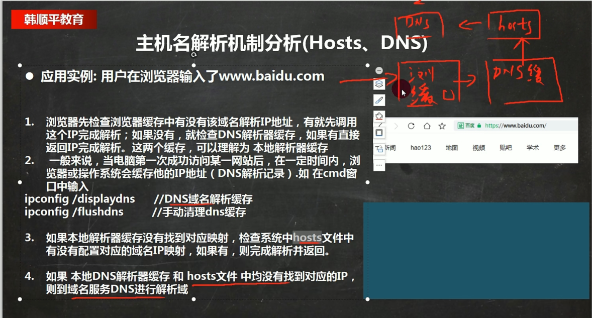
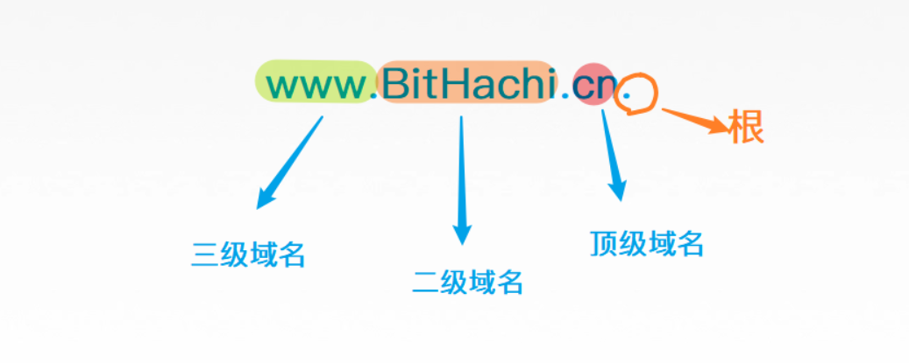
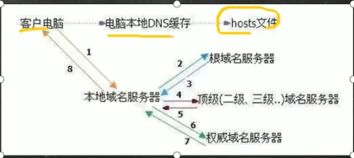

###  1.进程通信的方式有哪些

+ 匿名管道

  无名管道只能用于具有亲缘关系的进程间的通信。

+ 命名管道

  不相关的进程也能交换数据

+ 信号

  事件发生时对进程的通知机制，有时也称之为软件中断

+ 消息队列

  信号可以导致一个正在运行的进程被另一个正在运行的异步进程中断，转而处理某一个突发事件。

+ 共享内存+信号量

   信号量： P 操作和 V 操作

+ 内存映射

  是将磁盘文件的数据映射到内存，用户通过修改内存就能修改磁盘文件

+ Socket

  Socket 一般用于网络中不同主机上的进程之间的通信

### 2.线程的生命周期 

+   一个线程的生命周期，共包括五种状态，分别是新建、就绪、运行、阻塞、死亡。 

  1. ​    当线程被创建后，它默认处于新建状态。这时它就是一个普通的Java对象，并不会表现出任何线程的特征，线程体也不会被执行。此时，JVM会为线程对象分配内存，并初始化其成员变量的值。   
  2. ​    当调用线程对象的start()方法后，该线程处于就绪状态。这时线程也没有开始运行，这个状态只表示线程是可以运行的，至于线程何时运行，取决于JVM里线程调度器的调度。此时，JVM会为线程创建调用栈和程序计数器。   
  3. ​    如果线程获得了CPU开始执行线程体，则线程处于运行状态。对于单处理器的计算机，同一时刻只有一个线程处于运行状态。对于多处理器的计算机，将会有多个线程并行执行。   
  4. ​    线程开始运行后，不会一直处于运行状态，它会因为CPU的轮换而产生中断。具体来说，当发生如下情况时，线程会进入阻塞状态：调用sleep()、调用阻塞式IO方法、未抢到锁被阻塞、等待某个通知、被suspend()挂起。   
  5. ​    最后，线程会以如下三种方式结束，结束之后便进入死亡状态：线程体执行完毕、线程抛出异常、直接调用stop()方法来结束线程。   

    **加分回答** 

    当线程处于阻塞状态时，会通过如下情形解除阻塞，使其重新回到就绪状态： 

  -    调用的sleep()方法时间到了。    
  -    调用的阻塞式IO方法已经返回。    
  -    成功地抢到了锁。    
  -    其他线程发出了通知。    
  -    挂起的线程被resume()方法恢复。   

### 3.mybatis #和$的区别是什么

#{}解析成预编译语句 预编译之后直接执行，不需要重新编译sql.

${}仅作为一个字符串替换 执行前进行编译 存在sql注入

#### PrepareStatement和Statement

mybatis 底层使用了preparedstatement和占位符 默认情况下对所以sql进行预编译

```select * from `user` where `id` = ?;```

所谓的预编译，当我们把上面的那句SQL传给MySQL服务器的时候，服务器就已经帮我们编译了，编译成了一个SQL模板(可以类比函数)，同时占位符？成了参数，当我们使用setInt()、setString()插入数据时，实际上只是往SQL模板里面传入参数，这个过程编译与执行是分开的，模板被放入了模板池，当需要时取出插入数据即可，不需要继续编译。

`Statement`与`PrepareStatement`的区别在于，前者属于编译并执行，后者属于先编译后执行，前者给sql服务器传递了完整的sql语句，sql服务器就需要给整条语句进行编译，这时候如果进行了sql注入，sql服务器编织出得结果就会与我们的预期产生误差。

#### 预编译的作用：

1. 预编译对象可以重复利用，下一次同一个sql,可以直接使用这个PrepareStatement对象。数据库服务器不需要再次编译 可以提供性能
2. 防止sql注入 注入的参数不会认为它是一个sql,而是一个参数

### 4.解析域名的步骤

浏览器缓存-->本机系统的dns缓存-->hosts文件-->DNS







被人修改了本地hosts文件 叫域名劫持 ，目前浏览器会一定的防止域名劫持功能

