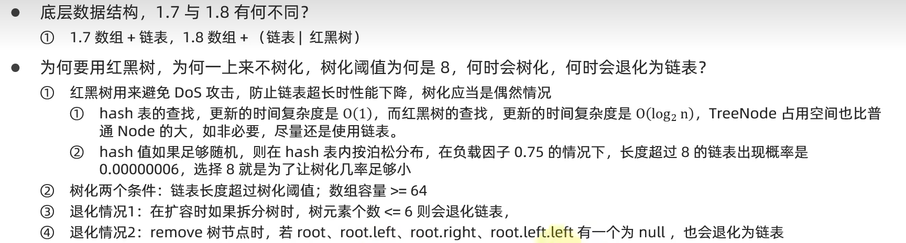

#  基础篇

选择排序和冒泡排序对比

1. 二者平均时间复杂度都是0(n2)
2. 选择排序一般要快于冒泡，因为其交换次数少
3. 但如果集合有序度高，冒泡优于选择，有序集合插入的时间复杂度为0(n)
4. 冒泡属于稳定排序算法，而选择属于不稳定排序

> 稳定排序就是根据两种条件排序两次，第二次排序不会影响第一次的顺序，
>
> 是在保持第一次的基础上进行的第二次

插入排序与选择排序比较
1. 二者平均时间复杂度都是0(n2)
2. 大部分情况下，插入都略优于选择
3. 有序集合插入的时间复杂度为0(n)
4. 插入属于稳定排序算法,而选择属于不稳定排序

冒泡：稳定排序
选择：不稳定
插入：稳定

#### ArrayList扩容机制

#### fail-fast和fail-safe

 #### HashMap

为什么用红黑树？

 

除数是2的n次方

求模运算可以等价为hash&(n-1)           按位与

 2 的n次幂的运行效率高 。 123 点都是配合 2 的n次幂的

如果考虑hash的分布均匀 应该选用余数的数 都是质数   .net的Dictionary使用的就是质数

容量×加载因子=扩容阈值

单例模式

#### 线程状态

notify后 会去重新拿锁 拿不到锁就是阻塞状态

